```mermaid
graph TB
    subgraph "🔴 SISTEM LAMA (AKTIF - Digunakan di Kode)"
        WS[website_settings<br/>19 rows<br/>✅ USED]
        NI[navigation_items<br/>5 rows<br/>✅ USED]
        CB[cta_buttons<br/>2 rows<br/>✅ USED]
        CI[contact_info<br/>3 rows<br/>✅ USED]
        SM[social_media<br/>4 rows<br/>✅ USED]
        FS[footer_sections<br/>3 rows<br/>✅ USED]
        FL[footer_links<br/>9 rows<br/>✅ USED]
    end

    subgraph "🟡 SISTEM BARU (TIDAK AKTIF - Tidak Ada di Kode)"
        P[pages<br/>4 rows<br/>❌ UNUSED]
        S[sections<br/>25 rows<br/>❌ UNUSED]
        PS[page_sections<br/>15 rows<br/>❌ UNUSED]
        T[themes<br/>4 rows<br/>❌ UNUSED]
    end

    subgraph "⚫ ZOMBIE TABLES (Kosong & Tidak Terpakai)"
        WS2[website_sections<br/>0 rows<br/>❌ ZOMBIE]
        AL[audit_log<br/>0 rows<br/>⚠️ NOT IMPLEMENTED]
        ML[media_library<br/>0 rows<br/>⚠️ NOT IMPLEMENTED]
    end

    subgraph "✅ TABEL AKTIF (Blog & Auth)"
        BP[blog_posts<br/>1 row<br/>✅ USED]
        BC[blog_categories<br/>4 rows<br/>✅ USED]
        AU[authors<br/>1 row<br/>✅ USED]
        PR[profiles<br/>3 rows<br/>✅ USED]
        RO[roles<br/>4 rows<br/>✅ USED]
        PE[permissions<br/>5 rows<br/>✅ USED]
        UP[user_permissions<br/>1 row<br/>✅ USED]
    end

    %% Connections
    P -.->|"Supposed to replace"| NI
    S -.->|"Supposed to replace"| CI
    S -.->|"Supposed to replace"| SM
    S -.->|"Supposed to replace"| CB
    T -.->|"Supposed to replace"| WS

    style P fill:#ff6b6b,stroke:#c92a2a,color:#fff
    style S fill:#ff6b6b,stroke:#c92a2a,color:#fff
    style PS fill:#ff6b6b,stroke:#c92a2a,color:#fff
    style T fill:#ff6b6b,stroke:#c92a2a,color:#fff
    style WS2 fill:#495057,stroke:#212529,color:#fff
    style AL fill:#868e96,stroke:#495057,color:#fff
    style ML fill:#868e96,stroke:#495057,color:#fff
    style WS fill:#51cf66,stroke:#2f9e44,color:#fff
    style NI fill:#51cf66,stroke:#2f9e44,color:#fff
    style CB fill:#51cf66,stroke:#2f9e44,color:#fff
    style CI fill:#51cf66,stroke:#2f9e44,color:#fff
    style SM fill:#51cf66,stroke:#2f9e44,color:#fff
    style FS fill:#51cf66,stroke:#2f9e44,color:#fff
    style FL fill:#51cf66,stroke:#2f9e44,color:#fff
```

## Legend:
- 🟢 **Green (Sistem Lama)**: Aktif digunakan di kode
- 🔴 **Red (Sistem Baru)**: Ada di database tapi TIDAK digunakan
- ⚫ **Gray (Zombie)**: Kosong atau tidak terpakai
- ✅ **Blue (Blog & Auth)**: Sistem yang berfungsi dengan baik

## Masalah:
1. **Duplikasi**: 2 sistem paralel untuk fungsi yang sama
2. **Waste**: ~800 kB untuk tabel yang tidak terpakai
3. **Confusion**: Developer bingung harus pakai yang mana
4. **Migration Incomplete**: V2 migration tidak diikuti update kode
